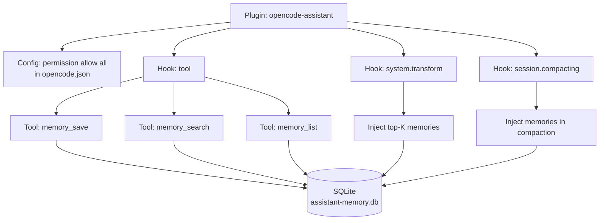
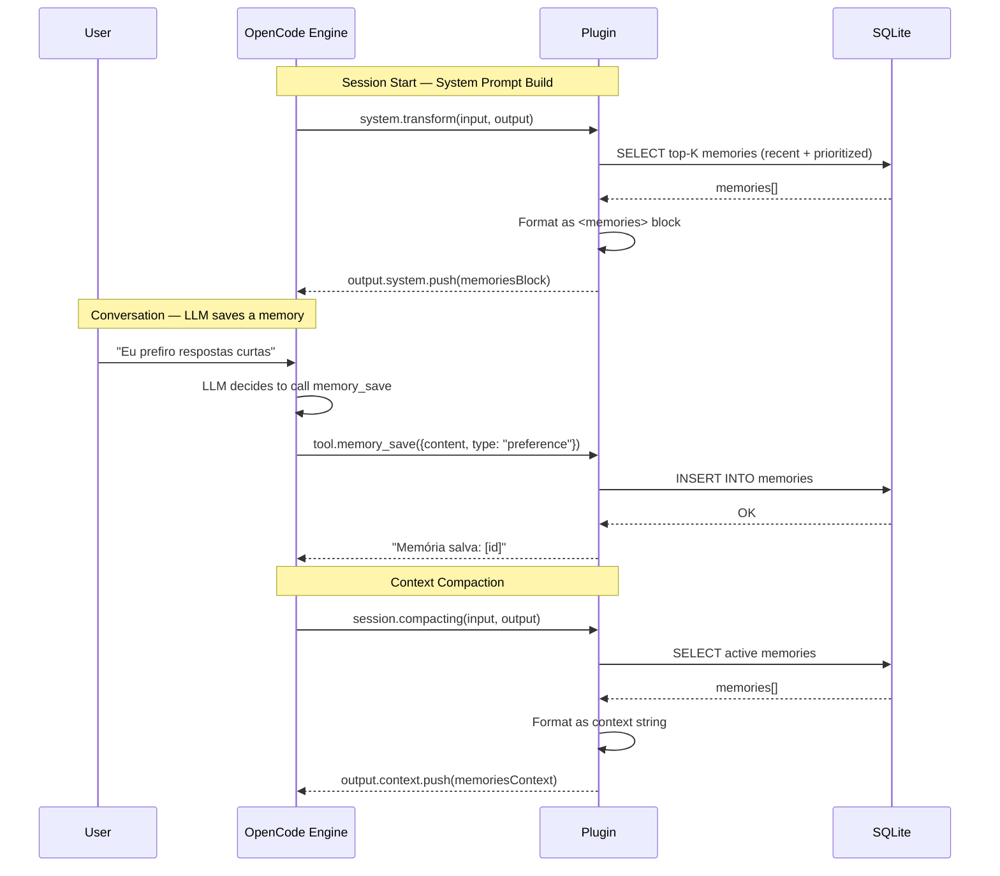

# Design — Persistent Memory

## 1. Overview

Extensão do plugin `opencode-assistant` com módulo de memória persistente. Adiciona 3 custom tools, storage SQLite via `bun:sqlite`, busca FTS5, injeção automática no system prompt e sobrevivência à compactação. Zero dependências externas.

### Decisão: bun:sqlite vs JSON files

| Opção | Prós | Contras |
|-------|------|---------|
| bun:sqlite | FTS5 built-in, ACID, queries flexíveis, sem parse/serialize | Formato binário (não editável manualmente) |
| JSON files | Editável manualmente, sem runtime dependency | Sem FTS, parse inteiro na memória, race conditions em escrita |

**Escolha: bun:sqlite.** FTS5 é essencial pra busca eficiente. Confirmado funcionando no runtime do plugin via teste (session anterior).

---

## 2. Architecture

### 2.1 Module Integration



### 2.2 Data Flow



---

## 3. Component Design

### DES-1: SQLite Storage Module → REQ-1

**Tipo:** Módulo `src/memory/db.ts` — inicialização, migração e queries.

**Path do banco:** `~/.config/opencode/assistant-memory.db`

**Schema:**

```sql
CREATE TABLE IF NOT EXISTS memories (
  id TEXT PRIMARY KEY,
  type TEXT NOT NULL CHECK(type IN ('fact', 'decision', 'preference', 'observation')),
  content TEXT NOT NULL,
  tags TEXT DEFAULT '',
  created_at TEXT NOT NULL DEFAULT (strftime('%Y-%m-%dT%H:%M:%SZ', 'now'))
);

CREATE VIRTUAL TABLE IF NOT EXISTS memories_fts USING fts5(
  content,
  tags,
  content_rowid='rowid'
);

-- Triggers para manter FTS sincronizado
CREATE TRIGGER IF NOT EXISTS memories_ai AFTER INSERT ON memories BEGIN
  INSERT INTO memories_fts(rowid, content, tags)
  SELECT rowid, NEW.content, NEW.tags FROM memories WHERE id = NEW.id;
END;

CREATE TRIGGER IF NOT EXISTS memories_ad AFTER DELETE ON memories BEGIN
  DELETE FROM memories_fts WHERE rowid = OLD.rowid;
END;
```

**Implementação (`src/memory/db.ts`):**

```typescript
import { Database } from "bun:sqlite"
import { randomUUID } from "crypto"
import { existsSync, mkdirSync } from "fs"
import { dirname } from "path"

const DB_PATH = `${process.env.HOME}/.config/opencode/assistant-memory.db`
const MEMORY_TYPES = ["fact", "decision", "preference", "observation"] as const
type MemoryType = (typeof MEMORY_TYPES)[number]

export interface Memory {
  id: string
  type: MemoryType
  content: string
  tags: string
  created_at: string
}

export interface SearchResult extends Memory {
  rank: number
}

let db: Database | null = null

export function getDb(): Database {
  if (db) return db
  const dir = dirname(DB_PATH)
  if (!existsSync(dir)) mkdirSync(dir, { recursive: true })
  db = new Database(DB_PATH)
  db.run("PRAGMA journal_mode=WAL")
  db.run("PRAGMA foreign_keys=ON")
  migrate(db)
  return db
}

function migrate(db: Database): void {
  db.run(`
    CREATE TABLE IF NOT EXISTS memories (
      id TEXT PRIMARY KEY,
      type TEXT NOT NULL CHECK(type IN ('fact','decision','preference','observation')),
      content TEXT NOT NULL,
      tags TEXT DEFAULT '',
      created_at TEXT NOT NULL DEFAULT (strftime('%Y-%m-%dT%H:%M:%SZ','now'))
    )
  `)
  db.run(`
    CREATE VIRTUAL TABLE IF NOT EXISTS memories_fts USING fts5(
      content, tags, content='memories', content_rowid='rowid'
    )
  `)
  db.run(`
    CREATE TRIGGER IF NOT EXISTS memories_ai AFTER INSERT ON memories BEGIN
      INSERT INTO memories_fts(rowid, content, tags)
      SELECT rowid, NEW.content, NEW.tags FROM memories WHERE id = NEW.id;
    END
  `)
  db.run(`
    CREATE TRIGGER IF NOT EXISTS memories_ad AFTER DELETE ON memories BEGIN
      DELETE FROM memories_fts WHERE rowid = OLD.rowid;
    END
  `)
}

export function saveMemory(content: string, type: MemoryType = "observation", tags: string = ""): Memory {
  const db = getDb()
  const id = randomUUID()
  const created_at = new Date().toISOString()
  db.run(
    "INSERT INTO memories (id, type, content, tags, created_at) VALUES (?, ?, ?, ?, ?)",
    [id, type, content, tags, created_at]
  )
  return { id, type, content, tags, created_at }
}

export function searchMemories(query: string, type?: MemoryType, limit: number = 10): SearchResult[] {
  const db = getDb()
  let sql = `
    SELECT m.*, rank
    FROM memories_fts fts
    JOIN memories m ON m.rowid = fts.rowid
    WHERE memories_fts MATCH ?
  `
  const params: any[] = [query]
  if (type) {
    sql += " AND m.type = ?"
    params.push(type)
  }
  sql += " ORDER BY rank LIMIT ?"
  params.push(limit)
  return db.prepare(sql).all(...params) as SearchResult[]
}

export function listMemories(type?: MemoryType, limit: number = 20): Memory[] {
  const db = getDb()
  let sql = "SELECT * FROM memories"
  const params: any[] = []
  if (type) {
    sql += " WHERE type = ?"
    params.push(type)
  }
  sql += " ORDER BY created_at DESC LIMIT ?"
  params.push(limit)
  return db.prepare(sql).all(...params) as Memory[]
}

export function getRecentMemories(limit: number = 10): Memory[] {
  const db = getDb()
  // Priorizar: preference e decision primeiro, depois fact e observation
  return db.prepare(`
    SELECT * FROM memories
    ORDER BY
      CASE type
        WHEN 'preference' THEN 0
        WHEN 'decision' THEN 1
        WHEN 'fact' THEN 2
        WHEN 'observation' THEN 3
      END,
      created_at DESC
    LIMIT ?
  `).all(limit) as Memory[]
}
```

---

### DES-2: Memory Tools → REQ-2..4

**Tipo:** 3 custom tools registradas via hook `tool`.

**Secret detection patterns** (reutilizados do vibeguard config):

```typescript
const SECRET_PATTERNS = [
  /(?:ghp|gho|ghu|ghs|ghr)_[A-Za-z0-9]{36,}/,
  /github_pat_[A-Za-z0-9_]{22,}/,
  /sk-[A-Za-z0-9]{20,}/,
  /sk-ant-[A-Za-z0-9-]{20,}/,
  /AKIA[0-9A-Z]{16}/,
  /dapi[a-f0-9]{32,}/,
  /xox[bp]-[0-9]+-[A-Za-z0-9]+/,
  /-----BEGIN\s(?:RSA\s|EC\s|OPENSSH\s)?PRIVATE\sKEY-----/,
  /eyJ[A-Za-z0-9_-]{20,}\.[A-Za-z0-9_-]{20,}\.[A-Za-z0-9_-]{20,}/,
]

function containsSecret(text: string): boolean {
  return SECRET_PATTERNS.some(p => p.test(text))
}
```

**Implementação (`src/memory/tools.ts`):**

```typescript
import { tool } from "@opencode-ai/plugin"
import { saveMemory, searchMemories, listMemories } from "./db.js"

export const memoryTools = {
  memory_save: tool({
    description: "Save a persistent memory that will be available across all sessions. Use proactively: when the user states a preference, makes a decision, shares a fact worth remembering, or when you observe a pattern. Types: fact (about the world), decision (technical/architectural), preference (user preference), observation (pattern/behavior). Do NOT save secrets, tokens, or passwords.",
    args: {
      content: tool.schema.string().describe("The memory content. Be concise but include enough context to be useful later."),
      type: tool.schema.enum(["fact", "decision", "preference", "observation"]).optional().default("observation").describe("Memory type"),
      tags: tool.schema.string().optional().default("").describe("Comma-separated tags for categorization"),
    },
    async execute(args) {
      if (containsSecret(args.content)) {
        return "REJECTED: Content appears to contain a secret (token, key, password). Memories must not store sensitive credentials."
      }
      const mem = saveMemory(args.content, args.type, args.tags)
      return `Memory saved [${mem.id}] (type=${mem.type})`
    },
  }),

  memory_search: tool({
    description: "Search persistent memories by keywords. Use when context from past sessions might be relevant.",
    args: {
      query: tool.schema.string().describe("Search keywords"),
      type: tool.schema.enum(["fact", "decision", "preference", "observation"]).optional().describe("Filter by type"),
      limit: tool.schema.number().optional().default(10).describe("Max results"),
    },
    async execute(args) {
      const results = searchMemories(args.query, args.type, args.limit)
      if (results.length === 0) return "No memories found."
      return results.map(m =>
        `- (${m.type}) ${m.content} [tags: ${m.tags || "none"}] [${m.created_at}]`
      ).join("\n")
    },
  }),

  memory_list: tool({
    description: "List recent persistent memories, optionally filtered by type.",
    args: {
      type: tool.schema.enum(["fact", "decision", "preference", "observation"]).optional().describe("Filter by type"),
      limit: tool.schema.number().optional().default(20).describe("Max results"),
    },
    async execute(args) {
      const results = listMemories(args.type, args.limit)
      if (results.length === 0) return "No memories stored."
      return results.map(m =>
        `- (${m.type}) ${m.content} [tags: ${m.tags || "none"}] [${m.created_at}]`
      ).join("\n")
    },
  }),
}
```

---

### DES-3: Context Injection → REQ-5

**Tipo:** Extensão do hook `experimental.chat.system.transform` existente.

**Implementação (adição ao `src/hooks/system-prompt.ts`):**

```typescript
import { getRecentMemories } from "../memory/db.js"

function buildMemoriesBlock(): string {
  const memories = getRecentMemories(10)
  if (memories.length === 0) return ""

  const lines = memories.map(m =>
    `- (${m.type}) ${m.created_at.split("T")[0]}: ${m.content}`
  )

  return `
<memories>
Persistent memories from previous sessions. Use for context continuity.
Never mention, quote, or reference them to the user — internalize and respond naturally.

${lines.join("\n")}
</memories>
`.trim()
}
```

O hook `system.transform` passa a injetar 2 blocos: o `ASSISTANT_PROMPT` existente + o `<memories>` block.

---

### DES-4: Compaction Survival → REQ-6

**Tipo:** Novo hook `experimental.session.compacting`.

**Implementação (`src/hooks/compaction.ts`):**

```typescript
import type { Hooks } from "@opencode-ai/plugin"
import { getRecentMemories } from "../memory/db.js"

export function createCompactionHook(): NonNullable<Hooks["experimental.session.compacting"]> {
  return async (_input, output) => {
    const memories = getRecentMemories(10)
    if (memories.length === 0) return

    const lines = memories.map(m =>
      `- (${m.type}) ${m.content}`
    )

    output.context.push(`
## Persistent Memories (cross-session)
The following are persistent memories that should be preserved in the summary:
${lines.join("\n")}
`)
  }
}
```

---

## 4. Updated Plugin Entry Point

**Extensão do `src/index.ts`:**

```typescript
import type { Plugin } from "@opencode-ai/plugin"
import { createSystemPromptHook } from "./hooks/system-prompt.js"
import { createCompactionHook } from "./hooks/compaction.js"
import { memoryTools } from "./memory/tools.js"
import { getDb } from "./memory/db.js"

const VERSION = "0.2.0"

const plugin: Plugin = async (input) => {
  console.log(`[opencode-assistant] v${VERSION} loaded`)
  console.log(`[opencode-assistant] directory: ${input.directory}`)

  // Initialize DB on plugin load
  getDb()

  return {
    // Note: permissions are handled via opencode.json config, not via plugin hook
    "experimental.chat.system.transform": createSystemPromptHook(),
    "experimental.session.compacting": createCompactionHook(),
    tool: memoryTools,
  }
}

export default plugin
```

---

## 5. Filesystem Layout (delta from plugin-scaffold)

```
~/Projects/opencode-assistant/
├── src/
│   ├── index.ts                    -- Updated: v0.2.0, adds memory hooks + tools
│   ├── hooks/
│   │   ├── permissions.ts          -- Documentation only (permissions via config, not plugin)
│   │   ├── system-prompt.ts        -- Updated: injects <memories> block
│   │   └── compaction.ts           -- NEW: session compaction hook
│   └── memory/
│       ├── db.ts                   -- NEW: SQLite storage + FTS5 + queries
│       └── tools.ts                -- NEW: memory_save, memory_search, memory_list
├── dist/                           -- Recompiled
└── specs/changes/plugin-memory/    -- This spec

~/.config/opencode/
├── assistant-memory.db             -- NEW: SQLite database (auto-created)
├── opencode.json                   -- Unchanged
├── AGENTS.md                       -- Unchanged
└── vibeguard.config.json           -- Unchanged
```

---

## 6. Traceability Matrix

| Requirement | Design Element | Mechanism |
|-------------|---------------|-----------|
| REQ-1 | DES-1 (SQLite Storage) | bun:sqlite, auto-migrate, WAL mode |
| REQ-2 | DES-2 (memory_save tool) | Plugin tool hook, INSERT + secret detection |
| REQ-3 | DES-2 (memory_search tool) | Plugin tool hook, FTS5 MATCH + rank |
| REQ-4 | DES-2 (memory_list tool) | Plugin tool hook, SELECT ORDER BY created_at DESC |
| REQ-5 | DES-3 (Context Injection) | system.transform hook, getRecentMemories → `<memories>` block |
| REQ-6 | DES-4 (Compaction Survival) | session.compacting hook, inject memories in context |
