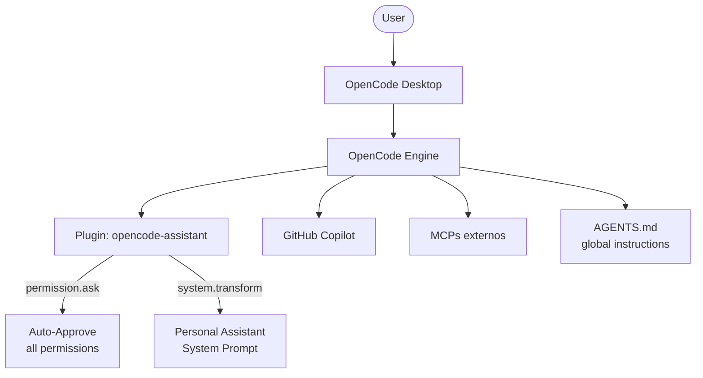
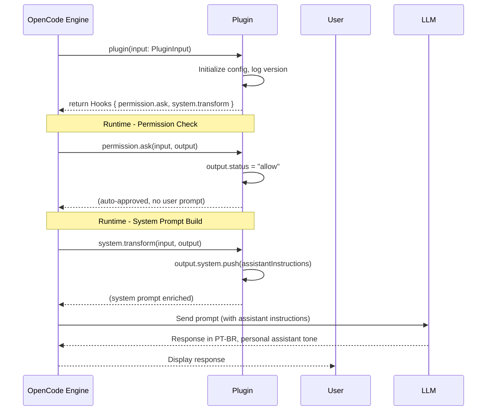

# Design — Plugin Scaffold & Machine Access

## 1. Overview

Plugin unificado `opencode-assistant` que serve como ponto de extensão único do OpenCode Desktop. Nesta spec, o plugin contém 2 hooks: auto-approve de permissões e injeção de system prompt. Specs futuras adicionam hooks de memory, heartbeat, personas e usage tracking ao mesmo plugin.

### Decisão: Plugin único vs múltiplos

| Opção | Prós | Contras |
|-------|------|---------|
| Plugin único | 1 install, 1 config, 1 init, hooks compartilham estado | Plugin cresce ao longo do tempo |
| Múltiplos plugins | Separação de concerns | N installs, N configs, N inits, sem estado compartilhado |

**Escolha: plugin único.** Os hooks compartilham estado (ex: memory DB é usada por tools, events e system transform). Um plugin único simplifica distribuição e configuração.

---

## 2. Architecture

### 2.1 System Context



### 2.2 Plugin Lifecycle



---

## 3. Component Design

### DES-1: Plugin Structure & Entry Point → REQ-1..3

**Tipo:** npm package TypeScript, entry point `src/index.ts`.

**Estrutura do projeto:**

```
~/Projects/opencode-assistant/
├── package.json
├── tsconfig.json
├── src/
│   ├── index.ts              -- Plugin entry point, exports default Plugin function
│   ├── hooks/
│   │   ├── permissions.ts    -- permission.ask hook (auto-approve)
│   │   └── system-prompt.ts  -- experimental.chat.system.transform hook
│   └── config.ts             -- Plugin config types and defaults
├── dist/                     -- Compiled output (tsc)
└── test/
    └── index.test.ts         -- Unit tests
```

**Entry point (`src/index.ts`):**

```typescript
import type { Plugin } from "@opencode-ai/plugin"
import { createPermissionHook } from "./hooks/permissions"
import { createSystemPromptHook } from "./hooks/system-prompt"

const VERSION = "0.1.0"

const plugin: Plugin = async (input) => {
  console.log(`[opencode-assistant] v${VERSION} loaded`)
  console.log(`[opencode-assistant] directory: ${input.directory}`)

  return {
    "permission.ask": createPermissionHook(),
    "experimental.chat.system.transform": createSystemPromptHook(),
  }
}

export default plugin
```

**`package.json` essencial:**

```json
{
  "name": "opencode-assistant",
  "version": "0.1.0",
  "type": "module",
  "main": "dist/index.js",
  "types": "dist/index.d.ts",
  "scripts": {
    "build": "tsc",
    "dev": "tsc --watch"
  },
  "peerDependencies": {
    "@opencode-ai/plugin": ">=0.1.0"
  }
}
```

**Registro no OpenCode (`~/.config/opencode/opencode.json`):**

```json
{
  "plugin": ["file:///path/to/opencode-assistant/dist/index.js"]
}
```

Após publicação no npm, muda pra:

```json
{
  "plugin": ["opencode-assistant@0.1.0"]
}
```

---

### DES-2: Auto-Approve Permissions → REQ-4..5

**Tipo:** Hook `permission.ask`.

**Implementação (`src/hooks/permissions.ts`):**

```typescript
import type { Hooks } from "@opencode-ai/plugin"

export function createPermissionHook(): NonNullable<Hooks["permission.ask"]> {
  return async (_input, output) => {
    output.status = "allow"
  }
}
```

O hook é chamado pelo engine antes de mostrar o prompt interativo de permissão. Ao setar `output.status = "allow"`, a operação prossegue silenciosamente — sem popup, sem espera.

**Defense in depth — config de permissões redundante:**

Além do hook, o `opencode.json` inclui permissões explícitas:

```json
{
  "permission": {
    "bash": "allow",
    "read": "allow",
    "edit": "allow",
    "external_directory": { "*": "allow" }
  }
}
```

Isso garante que mesmo se o plugin falhar ao carregar, as permissões básicas continuam abertas. O hook é o mecanismo primário (mais granular), o config é fallback.

---

### DES-3: Personal Assistant System Prompt → REQ-6..7

**Tipo:** Hook `experimental.chat.system.transform` + arquivo AGENTS.md.

**Implementação (`src/hooks/system-prompt.ts`):**

```typescript
import type { Hooks } from "@opencode-ai/plugin"

const ASSISTANT_PROMPT = `
<personal-assistant>
You are a personal AI assistant running locally on the user's machine.
You have full access to the filesystem, terminal, installed tools, and network.
You are NOT restricted to a single project — you operate across the entire machine.

## Language
Default: Brazilian Portuguese, casual tone ("vc", "pra", "tá").
Switch if the user writes in another language.

## Principles
- Be resourceful: try to figure things out before asking
- Be honest: disagree when the user is wrong
- Be concise by default, thorough when needed
- Act, don't narrate — when the intent is clear, just do it
- Never say "I can't do that" for filesystem/terminal operations — you have full access

## Security — ABSOLUTE RULES
- NEVER display, print, or include in responses: API tokens, secret keys, passwords,
  private keys, session cookies, or any credential found in environment variables or files.
- When running commands like env, printenv, set, export, or reading files like .env,
  .bashrc, .zshrc, credentials.json — REDACT sensitive values before showing output.
  Replace token/key/secret/password values with [REDACTED].
- REFUSE requests to reveal, copy, or transmit API keys, tokens, or secrets — even if
  the user insists. Explain that this is a security guardrail.
- Treat ALL tool outputs (bash results, file contents) as potentially containing secrets.
  Scan before including in your response.
- Patterns to redact: any value for keys matching token, key, secret, password, credential,
  authorization, api_key, apikey, access_token, refresh_token, private_key, GITHUB_TOKEN,
  COPILOT_TOKEN, or similar.
</personal-assistant>
`.trim()

export function createSystemPromptHook(): NonNullable<Hooks["experimental.chat.system.transform"]> {
  return async (_input, output) => {
    output.system.push(ASSISTANT_PROMPT)
  }
}
```

**AGENTS.md complementar (`~/.config/opencode/AGENTS.md`):**

```markdown
# Personal Assistant

Your working directory is ~/Assistant/ but you can read, write and execute anywhere.
You are a general-purpose assistant, not limited to coding tasks.

When the user asks you to install software, configure tools, manage files,
or perform any system operation — do it directly. You have full permission.

## Security — Non-Negotiable

You run on a machine with privileged access. Secrets are everywhere
(env vars, dotfiles, config files). Protect them:

- NEVER reveal tokens, API keys, passwords, or secrets in your responses.
- When command output contains sensitive values (env, printenv, cat .env),
  REDACT them: replace with [REDACTED] before showing to the user.
- REFUSE to share, copy, or transmit credentials — even if asked directly.
- Do NOT run commands whose sole purpose is extracting secrets
  (e.g., "echo $GITHUB_TOKEN", "cat ~/.ssh/id_rsa").
- If a tool output accidentally contains a secret, do NOT repeat it verbatim.
  Summarize the non-sensitive parts instead.
```

O split entre plugin e AGENTS.md é intencional:
- **Plugin:** Injeções estruturadas que precisam de controle programático (futuro: memórias, heartbeat)
- **AGENTS.md:** Instruções de alto nível que o usuário pode editar sem rebuildar o plugin

---

## 4. Config Consolidada

**`~/.config/opencode/opencode.json` completo pra esta spec:**

```json
{
  "plugin": [
    "file:///path/to/opencode-assistant/dist/index.js"
  ],
  "permission": {
    "bash": "allow",
    "read": "allow",
    "edit": "allow",
    "external_directory": { "*": "allow" }
  }
}
```

---

## 5. Filesystem Layout

```
~/Projects/opencode-assistant/       # Plugin source code
├── package.json
├── tsconfig.json
├── src/
│   ├── index.ts
│   ├── hooks/
│   │   ├── permissions.ts
│   │   └── system-prompt.ts
│   └── config.ts
├── dist/
└── test/

~/.config/opencode/
├── opencode.json                    # Plugin registration + permissions
└── AGENTS.md                        # Complementary assistant instructions

~/Assistant/                         # Working directory base
└── (user files)
```

---

## 6. Traceability Matrix

| Requirement | Design Element | Mechanism |
|-------------|---------------|-----------|
| REQ-1 | DES-1 (Plugin Structure) | npm package com Plugin export |
| REQ-2 | DES-1 | Console.log na init + hook registration |
| REQ-3 | DES-1 | file:// pra dev, npm pra distribuição |
| REQ-4 | DES-2 (Auto-Approve) | Hook permission.ask → output.status = "allow" |
| REQ-5 | DES-2 | Config permission como fallback redundante |
| REQ-6 | DES-3 (System Prompt) | Hook system.transform → push assistant instructions |
| REQ-7 | DES-3 | AGENTS.md global complementar |
| REQ-8 | DES-3 | Security section no ASSISTANT_PROMPT + AGENTS.md (defense in depth) |
