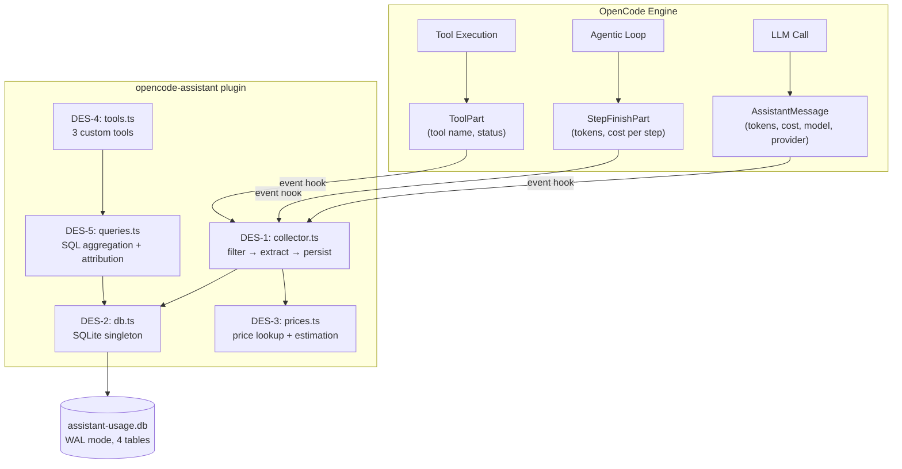

# Design — Usage Tracking & Cost Estimation

## 1. Overview

Este design adiciona tracking de consumo de tokens ao plugin `opencode-assistant` usando o hook `event` do SDK para coleta passiva, SQLite dedicado para persistência, e custom tools para consulta e projeção. Specs futuras podem adicionar alertas e dashboard UI sobre essa mesma fundação de dados.

**Constraint arquitetural mantida:** Zero patches no engine. Toda a funcionalidade via plugin hooks, SQLite local e custom tools.

---

## 2. Architecture



**Fluxo de dados:**

1. Engine emite evento (message.updated, message.part.updated)
2. DES-1 (`collector.ts`) filtra por tipo relevante (AssistantMessage, StepFinishPart, ToolPart terminal)
3. DES-1 extrai campos, calcula `cost_estimated` via DES-3 (`prices.ts`)
4. DES-2 (`db.ts`) persiste em tabela apropriada (fire-and-forget, try/catch)
5. Quando o LLM chama uma usage tool, DES-5 (`queries.ts`) executa SQL com agregação

### Traceability

| Design Element | Requirements |
|---|---|
| DES-1 (collector.ts) | REQ-1 (1.1, 1.2, 1.3, 1.4) |
| DES-2 (db.ts) | REQ-2 (2.1–2.6) |
| DES-3 (prices.ts) | REQ-3 (3.1–3.5) |
| DES-4 (tools.ts) | REQ-4, REQ-5, REQ-6 |
| DES-5 (queries.ts) | REQ-4 (4.3), REQ-5 (5.3), REQ-7 (7.1–7.3) |

---

## 3. Design Elements

### DES-1: Event Collector (`collector.ts`)
Event handler que filtra, extrai e persiste eventos de uso. Implementa REQ-1.

### DES-2: Usage Database (`db.ts`)
SQLite singleton para `assistant-usage.db` — schema, migrations, CRUD. Implementa REQ-2.

### DES-3: Price Engine (`prices.ts`)
Tabela de preços seed, lookup com fallback (exact → wildcard → fuzzy prefix) e cálculo de custo estimado. Implementa REQ-3.

### DES-4: Custom Tools (`tools.ts`)
3 custom tools expostas ao LLM: `usage_summary`, `usage_query`, `usage_estimate`. Implementa REQ-4, REQ-5, REQ-6.

### DES-5: Query Builders (`queries.ts`)
SQL builders pra agregação por dia/modelo/sessão/tool, filtragem dinâmica, projeção estatística e cost attribution. Implementa REQ-4.3, REQ-5.3, REQ-7.

## 4. Database Schema

```sql
-- DES-2: Usage database (assistant-usage.db)

-- DES-2.1: Message-level usage (1 row per assistant message)
CREATE TABLE IF NOT EXISTS message_usage (
    id              TEXT PRIMARY KEY,  -- messageID from engine
    session_id      TEXT NOT NULL,
    model_id        TEXT NOT NULL,
    provider_id     TEXT NOT NULL,
    tokens_input    INTEGER NOT NULL DEFAULT 0,
    tokens_output   INTEGER NOT NULL DEFAULT 0,
    tokens_reasoning INTEGER NOT NULL DEFAULT 0,
    tokens_cache_read  INTEGER NOT NULL DEFAULT 0,
    tokens_cache_write INTEGER NOT NULL DEFAULT 0,
    cost_reported   REAL NOT NULL DEFAULT 0.0,  -- from engine (may be 0)
    cost_estimated  REAL NOT NULL DEFAULT 0.0,  -- calculated from price_table
    price_missing   INTEGER NOT NULL DEFAULT 0, -- 1 if model not in price_table
    created_at      INTEGER NOT NULL,           -- epoch ms from message.time.created
    completed_at    INTEGER                     -- epoch ms from message.time.completed
);

-- DES-2.2: Step-level usage (1 row per agentic loop step)
CREATE TABLE IF NOT EXISTS step_usage (
    id              TEXT PRIMARY KEY,  -- step part ID from engine
    session_id      TEXT NOT NULL,
    message_id      TEXT NOT NULL,
    tokens_input    INTEGER NOT NULL DEFAULT 0,
    tokens_output   INTEGER NOT NULL DEFAULT 0,
    tokens_reasoning INTEGER NOT NULL DEFAULT 0,
    tokens_cache_read  INTEGER NOT NULL DEFAULT 0,
    tokens_cache_write INTEGER NOT NULL DEFAULT 0,
    cost_reported   REAL NOT NULL DEFAULT 0.0,
    cost_estimated  REAL NOT NULL DEFAULT 0.0,
    reason          TEXT,              -- step finish reason
    created_at      INTEGER NOT NULL   -- epoch ms
);

-- DES-2.3: Tool-level usage (1 row per tool invocation)
CREATE TABLE IF NOT EXISTS tool_usage (
    id              TEXT PRIMARY KEY,  -- tool part ID from engine
    session_id      TEXT NOT NULL,
    message_id      TEXT NOT NULL,
    call_id         TEXT NOT NULL,
    tool_name       TEXT NOT NULL,
    status          TEXT NOT NULL CHECK(status IN ('completed','error')),
    created_at      INTEGER NOT NULL   -- epoch ms
);

-- DES-2.4: Price table (reference data, updatable)
CREATE TABLE IF NOT EXISTS price_table (
    model_id                TEXT NOT NULL,
    provider_id             TEXT NOT NULL,
    input_price_per_mtok    REAL NOT NULL,  -- USD per 1M tokens
    output_price_per_mtok   REAL NOT NULL,
    cache_read_price_per_mtok  REAL NOT NULL DEFAULT 0.0,
    cache_write_price_per_mtok REAL NOT NULL DEFAULT 0.0,
    currency                TEXT NOT NULL DEFAULT 'USD',
    updated_at              TEXT NOT NULL DEFAULT (strftime('%Y-%m-%dT%H:%M:%SZ','now')),
    PRIMARY KEY (model_id, provider_id)
);

-- Indexes for query performance (DES-5)
CREATE INDEX IF NOT EXISTS idx_message_usage_session ON message_usage(session_id);
CREATE INDEX IF NOT EXISTS idx_message_usage_created ON message_usage(created_at);
CREATE INDEX IF NOT EXISTS idx_message_usage_model   ON message_usage(model_id);
CREATE INDEX IF NOT EXISTS idx_step_usage_message    ON step_usage(message_id);
CREATE INDEX IF NOT EXISTS idx_step_usage_created    ON step_usage(created_at);
CREATE INDEX IF NOT EXISTS idx_tool_usage_message    ON tool_usage(message_id);
CREATE INDEX IF NOT EXISTS idx_tool_usage_tool       ON tool_usage(tool_name);
CREATE INDEX IF NOT EXISTS idx_tool_usage_created    ON tool_usage(created_at);
```

**Decisão: epoch ms vs ISO string para timestamps.** O engine usa epoch ms (`time.created`, `time.completed`). Armazenar como INTEGER evita parsing e simplifica range queries. Conversão para human-readable acontece na camada de tools (na saída).

**Decisão: ID strategy.** O `messageID` do engine é garantido único por sessão. Usado diretamente como PK em `message_usage`. O `id` do `StepFinishPart` e `ToolPart` também vem do engine. Reusar IDs do engine garante idempotência natural (INSERT OR IGNORE).

---

## 5. Event Collector (DES-1)

```typescript
// src/usage/collector.ts

import type { Event } from "@opencode-ai/sdk"

export function createUsageEventHandler() {
  return async ({ event }: { event: Event }) => {
    try {
      switch (event.type) {
        case "message.updated":
          handleMessageUpdated(event)
          break
        case "message.part.updated":
          handlePartUpdated(event)
          break
      }
    } catch (err) {
      // REQ-1.4: fire-and-forget, log but don't throw
      console.error("[usage] event capture error:", err)
    }
  }
}
```

### Message handler (REQ-1.1)

```typescript
function handleMessageUpdated(event: EventMessageUpdated) {
  const msg = event.properties.info
  if (msg.role !== "assistant") return
  if (!msg.tokens || msg.tokens.input === 0) return  // skip empty/incomplete

  const estimated = estimateCost(msg.modelID, msg.providerID, msg.tokens)
  
  upsertMessageUsage({
    id: msg.id,
    session_id: msg.sessionID,
    model_id: msg.modelID,
    provider_id: msg.providerID,
    tokens_input: msg.tokens.input,
    tokens_output: msg.tokens.output,
    tokens_reasoning: msg.tokens.reasoning,
    tokens_cache_read: msg.tokens.cache.read,
    tokens_cache_write: msg.tokens.cache.write,
    cost_reported: msg.cost,
    cost_estimated: estimated.cost,
    price_missing: estimated.missing ? 1 : 0,
    created_at: msg.time.created,
    completed_at: msg.time.completed ?? null,
  })
}
```

**Decisão: UPSERT em vez de INSERT.** O engine emite `message.updated` múltiplas vezes para a mesma mensagem (streaming progressivo). Cada update traz tokens acumulados. O plugin faz `INSERT OR REPLACE` para sempre manter o snapshot mais recente. Isso garante idempotência (NFR-6).

### Step handler (REQ-1.2)

```typescript
function handlePartUpdated(event: EventMessagePartUpdated) {
  const part = event.properties.part

  if (part.type === "step-finish") {
    upsertStepUsage({
      id: part.id,
      session_id: part.sessionID,
      message_id: part.messageID,
      tokens_input: part.tokens.input,
      tokens_output: part.tokens.output,
      tokens_reasoning: part.tokens.reasoning,
      tokens_cache_read: part.tokens.cache.read,
      tokens_cache_write: part.tokens.cache.write,
      cost_reported: part.cost,
      cost_estimated: 0,  // calculated on read via join with message_usage
      reason: part.reason,
      created_at: Date.now(),
    })
  }

  if (part.type === "tool" && isTerminal(part.state)) {
    upsertToolUsage({
      id: part.id,
      session_id: part.sessionID,
      message_id: part.messageID,
      call_id: part.callID,
      tool_name: part.tool,
      status: part.state.status,
      created_at: Date.now(),
    })
  }
}
```

**Decisão: `cost_estimated` no step.** O `StepFinishPart` não traz `modelID`/`providerID`. Em vez de duplicar essa informação, o custo estimado do step é calculado na query (join com `message_usage` do mesmo `message_id`). Mantém a escrita rápida e evita inconsistências.

---

## 6. Price Table (DES-3)

### Seed data (preços de referência, Jul 2025)

```typescript
// src/usage/prices.ts

export const DEFAULT_PRICES: PriceEntry[] = [
  // OpenAI models (preços oficiais)
  { model_id: "gpt-4o",           provider_id: "*", input: 2.50,  output: 10.00, cache_read: 1.25, cache_write: 2.50 },
  { model_id: "gpt-4o-mini",      provider_id: "*", input: 0.15,  output: 0.60,  cache_read: 0.075, cache_write: 0.15 },
  { model_id: "gpt-4.1",          provider_id: "*", input: 2.00,  output: 8.00,  cache_read: 0.50, cache_write: 2.00 },
  { model_id: "gpt-4.1-mini",     provider_id: "*", input: 0.40,  output: 1.60,  cache_read: 0.10, cache_write: 0.40 },
  { model_id: "gpt-4.1-nano",     provider_id: "*", input: 0.10,  output: 0.40,  cache_read: 0.025, cache_write: 0.10 },
  { model_id: "o3",               provider_id: "*", input: 2.00,  output: 8.00,  cache_read: 0.50, cache_write: 2.00 },
  { model_id: "o3-mini",          provider_id: "*", input: 1.10,  output: 4.40,  cache_read: 0.275, cache_write: 1.10 },
  { model_id: "o4-mini",          provider_id: "*", input: 1.10,  output: 4.40,  cache_read: 0.275, cache_write: 1.10 },

  // Anthropic models (preços oficiais)
  { model_id: "claude-sonnet-4-20250514",   provider_id: "*", input: 3.00, output: 15.00, cache_read: 0.30, cache_write: 3.75 },
  { model_id: "claude-opus-4-20250514",     provider_id: "*", input: 15.00, output: 75.00, cache_read: 1.50, cache_write: 18.75 },
  { model_id: "claude-3.5-sonnet",          provider_id: "*", input: 3.00, output: 15.00, cache_read: 0.30, cache_write: 3.75 },
  { model_id: "claude-3.5-haiku",           provider_id: "*", input: 0.80, output: 4.00,  cache_read: 0.08, cache_write: 1.00 },

  // Google models (preços oficiais, tier <128K)
  { model_id: "gemini-2.5-pro",   provider_id: "*", input: 1.25, output: 10.00, cache_read: 0.315, cache_write: 1.25 },
  { model_id: "gemini-2.5-flash", provider_id: "*", input: 0.15, output: 0.60,  cache_read: 0.0375, cache_write: 0.15 },
]
```

**Decisão: `provider_id: "*"` como wildcard.** O mesmo modelo (ex: "gpt-4o") pode aparecer via provider "copilot", "openai", ou custom. Usar wildcard simplifica o lookup: buscar primeiro por (model_id, provider_id) exato, fallback pra (model_id, "*").

### Função de lookup

```typescript
export function estimateCost(
  modelId: string,
  providerId: string,
  tokens: { input: number; output: number; reasoning: number; cache: { read: number; write: number } }
): { cost: number; missing: boolean } {
  const price = lookupPrice(modelId, providerId)
  if (!price) return { cost: 0, missing: true }

  const cost =
    (tokens.input * price.input_price_per_mtok +
     tokens.output * price.output_price_per_mtok +
     tokens.cache.read * price.cache_read_price_per_mtok +
     tokens.cache.write * price.cache_write_price_per_mtok) / 1_000_000

  return { cost, missing: false }
}

function lookupPrice(modelId: string, providerId: string): PriceRow | null {
  const db = getUsageDb()
  // Exact match first
  let row = db.prepare(
    "SELECT * FROM price_table WHERE model_id = ? AND provider_id = ?"
  ).get(modelId, providerId)
  if (row) return row as PriceRow
  // Wildcard fallback
  row = db.prepare(
    "SELECT * FROM price_table WHERE model_id = ? AND provider_id = '*'"
  ).get(modelId)
  if (row) return row as PriceRow
  // Fuzzy: try prefix match (e.g., "claude-sonnet-4-20250514" → "claude-sonnet-4")
  row = db.prepare(
    "SELECT * FROM price_table WHERE ? LIKE model_id || '%' AND provider_id = '*' ORDER BY length(model_id) DESC LIMIT 1"
  ).get(modelId)
  return row as PriceRow | null
}
```

**Decisão: fuzzy prefix match.** Model IDs do engine podem ter sufixos de data/versão não presentes na tabela de preços (ex: "claude-sonnet-4-20250514" vs "claude-sonnet-4"). O lookup tenta match exato → wildcard → prefixo, nessa ordem.

---

## 7. Custom Tools (DES-4)

### usage_summary (REQ-4)

```typescript
export const usageSummary: ToolDefinition = {
  description: "Returns a summary of token usage and estimated costs. " +
    "Supports grouping by day, model, session, or tool. " +
    "Use for questions like 'how much have I used?', 'which model costs more?', 'which tools are most expensive?'.",
  parameters: {
    type: "object",
    properties: {
      period:   { type: "string", enum: ["today", "7d", "30d", "all"], default: "7d",
                  description: "Time period to summarize" },
      group_by: { type: "string", enum: ["day", "model", "session", "tool"], default: "day",
                  description: "How to group the results" },
    },
  },
  execute: async (args) => { /* ... query + format ... */ },
}
```

**Aggregation queries** (em `queries.ts`):

```sql
-- group_by = "day"
SELECT
  date(created_at / 1000, 'unixepoch', 'localtime') AS day,
  SUM(tokens_input + tokens_output + tokens_reasoning) AS total_tokens,
  SUM(tokens_input) AS input_tokens,
  SUM(tokens_output) AS output_tokens,
  SUM(cost_estimated) AS estimated_cost_usd,
  COUNT(*) AS message_count
FROM message_usage
WHERE created_at >= ?  -- period start epoch ms
GROUP BY day
ORDER BY day DESC;

-- group_by = "tool"
SELECT
  t.tool_name,
  COUNT(*) AS invocations,
  SUM(CASE WHEN t.status = 'completed' THEN 1 ELSE 0 END) AS successes,
  SUM(CASE WHEN t.status = 'error' THEN 1 ELSE 0 END) AS errors,
  -- Cost attribution: step cost / tool count in step (REQ-7.2)
  SUM(s.cost_estimated / NULLIF(tc.tool_count, 0)) AS attributed_cost_usd
FROM tool_usage t
JOIN step_usage s ON s.message_id = t.message_id
JOIN (
  SELECT message_id, COUNT(*) AS tool_count
  FROM tool_usage
  GROUP BY message_id
) tc ON tc.message_id = t.message_id
WHERE t.created_at >= ?
GROUP BY t.tool_name
ORDER BY invocations DESC;
```

### usage_query (REQ-5)

```typescript
export const usageQuery: ToolDefinition = {
  description: "Query detailed usage records with filters. " +
    "Returns individual message and tool usage events. " +
    "Use for drill-down analysis like 'show me all bash tool calls this week'.",
  parameters: {
    type: "object",
    properties: {
      session_id: { type: "string", description: "Filter by session ID" },
      model_id:   { type: "string", description: "Filter by model (e.g. 'gpt-4o')" },
      tool_name:  { type: "string", description: "Filter by tool name (e.g. 'bash', 'read')" },
      from_date:  { type: "string", description: "Start date (ISO format, e.g. '2025-07-01')" },
      to_date:    { type: "string", description: "End date (ISO format)" },
      limit:      { type: "number", default: 50, description: "Max records to return" },
    },
  },
  execute: async (args) => { /* ... dynamic WHERE builder + query ... */ },
}
```

### usage_estimate (REQ-6)

```typescript
export const usageEstimate: ToolDefinition = {
  description: "Projects future token usage and costs based on historical patterns. " +
    "Use for questions like 'how much will I spend this month?', 'what's my projected usage?'.",
  parameters: {
    type: "object",
    properties: {
      horizon:  { type: "string", enum: ["week", "month", "quarter"],
                  description: "Projection period" },
      based_on: { type: "string", default: "30d",
                  description: "Historical period to base projection on (e.g. '7d', '30d')" },
    },
    required: ["horizon"],
  },
  execute: async (args) => { /* ... avg/stddev + projection ... */ },
}
```

**Projection logic:**

```sql
-- Base stats for projection
SELECT
  COUNT(DISTINCT date(created_at / 1000, 'unixepoch', 'localtime')) AS active_days,
  SUM(tokens_input + tokens_output + tokens_reasoning) AS total_tokens,
  SUM(cost_estimated) AS total_cost,
  AVG(daily_tokens) AS avg_daily_tokens,
  AVG(daily_cost) AS avg_daily_cost,
  -- Simple stddev for confidence interval
  AVG(daily_tokens * daily_tokens) - AVG(daily_tokens) * AVG(daily_tokens) AS var_tokens,
  AVG(daily_cost * daily_cost) - AVG(daily_cost) * AVG(daily_cost) AS var_cost
FROM (
  SELECT
    date(created_at / 1000, 'unixepoch', 'localtime') AS day,
    SUM(tokens_input + tokens_output + tokens_reasoning) AS daily_tokens,
    SUM(cost_estimated) AS daily_cost
  FROM message_usage
  WHERE created_at >= ?
  GROUP BY day
) daily;
```

Horizonte em dias: week=7, month=30, quarter=90.

```
projected_tokens = avg_daily_tokens × horizon_days
projected_cost   = avg_daily_cost × horizon_days
confidence_low   = (avg_daily - sqrt(variance)) × horizon_days
confidence_high  = (avg_daily + sqrt(variance)) × horizon_days
```

Quando `active_days < 3`, retornar `{ warning: "Less than 3 days of data — projection unreliable" }`.

---

## 8. Plugin Integration (index.ts changes)

```typescript
// src/index.ts — additions (DES-1, DES-4)

import { getUsageDb } from "./usage/db.js"
import { createUsageEventHandler } from "./usage/collector.js"
import { usageSummary, usageQuery, usageEstimate } from "./usage/tools.js"

const plugin: Plugin = async (input) => {
  // ... existing init ...

  // Initialize usage DB on boot (separate from memory DB)
  getUsageDb()
  console.log(`[opencode-assistant] usage: ready`)

  return {
    // ... existing hooks ...
    event: createUsageEventHandler(),          // NEW: passive capture
    tool: {
      // ... existing memory tools ...
      usage_summary: usageSummary,             // NEW
      usage_query: usageQuery,                 // NEW
      usage_estimate: usageEstimate,           // NEW
    },
  }
}
```

---

## 9. File Structure (additions)

```
src/
├── index.ts                 ← modified: register event hook + 3 usage tools
├── hooks/                   ← unchanged
├── memory/                  ← unchanged
└── usage/                   ← NEW module
    ├── db.ts                ← DES-2: SQLite singleton, schema, migrations, CRUD
    ├── collector.ts         ← DES-1: event handler, message/step/tool extraction
    ├── prices.ts            ← DES-3: price table seed, estimateCost(), lookupPrice()
    ├── queries.ts           ← DES-5: SQL builders for aggregation + attribution
    └── tools.ts             ← DES-4: 3 ToolDefinition exports

test/
├── usage-db.test.ts         ← NEW: schema, CRUD, idempotency
├── usage-collector.test.ts  ← NEW: event filtering, extraction, fire-and-forget
├── usage-prices.test.ts     ← NEW: lookup, fuzzy match, estimation
├── usage-queries.test.ts    ← NEW: aggregation, attribution, projection
└── usage-tools.test.ts      ← NEW: tool args validation, output format
```

---

## 10. Design Decisions Log

| # | Decision | Rationale | Alternatives considered |
|---|----------|-----------|------------------------|
| DD-1 | DB separado (`assistant-usage.db`) | Domínios diferentes (memória vs métricas), ciclo de vida diferente, evita lock contention | Mesma DB com schema separado — rejeitado por acoplamento |
| DD-2 | Epoch ms para timestamps | Engine usa epoch ms nativamente, range queries eficientes, sem parsing | ISO strings — rejeitado por overhead de conversão |
| DD-3 | UPSERT (INSERT OR REPLACE) | Engine emite múltiplos updates por mensagem (streaming), idempotência natural | INSERT com dedup check — mais complexo, mesmo resultado |
| DD-4 | Wildcard + fuzzy prefix no price lookup | Model IDs variam entre providers e versões, lookup flexível reduz `price_missing` | Match exato only — rejeitado por fragilidade |
| DD-5 | Cost attribution on read (não on write) | Tool events podem chegar antes do step finish, cálculo na query evita reprocessamento | Attribution on write — rejeitado por dependência de ordem |
| DD-6 | Fire-and-forget no collector | Tracking NÃO DEVE impactar o fluxo do assistente, erro de DB não pode bloquear o LLM | Retry queue — over-engineering para uso pessoal |
| DD-7 | `provider_id: "*"` wildcard | Mesmo modelo pode vir de providers diferentes (copilot, openai), preço é do modelo não do provider | Tabela por provider — duplicação desnecessária |

---

## 11. Risks & Mitigations

| Risk | Impact | Probability | Mitigation |
|------|--------|-------------|------------|
| Engine não emite todos os eventos esperados | Dados incompletos | Média | A-1 assume baseado no SDK v1.3.3; validar empiricamente na Phase 0 |
| Model IDs do Copilot não mapeiam para tabela de preços | cost_estimated = 0 com price_missing = 1 | Média | Fuzzy prefix match (DD-4) + log de modelos não mapeados para ajuste manual |
| `message.updated` emitido antes de tokens estarem preenchidos | Row com zeros que nunca atualiza | Baixa | Filtro `tokens.input === 0` descarta mensagens incompletas; UPSERT sobrescreve se vier update |
| Volume cresce mais que o esperado | Queries lentas | Baixa | Índices criados upfront; para 90K rows é trivial para SQLite |
| Hook `event` tem bugs no SDK (experimental) | Captura falha silenciosamente | Baixa | Fire-and-forget + log de erros; dados podem ser reconstruídos do engine DB se necessário |
